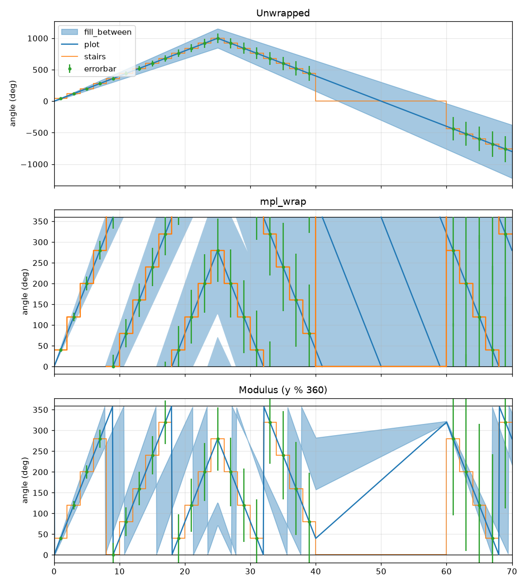
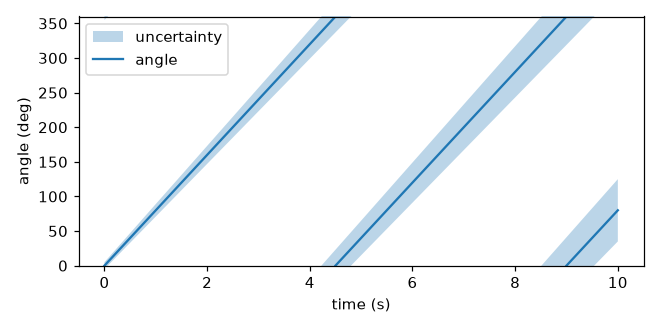
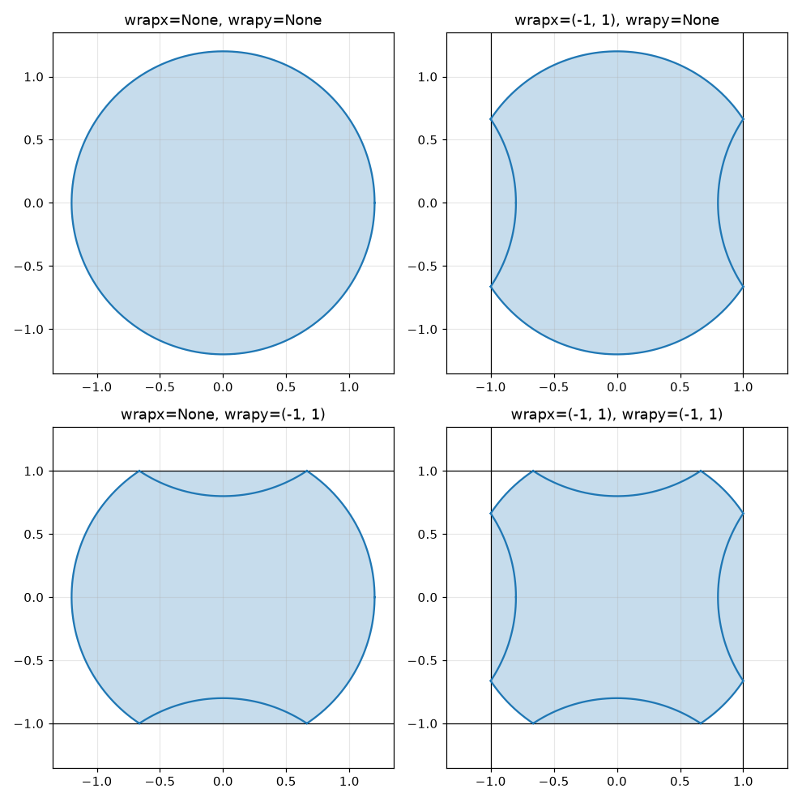
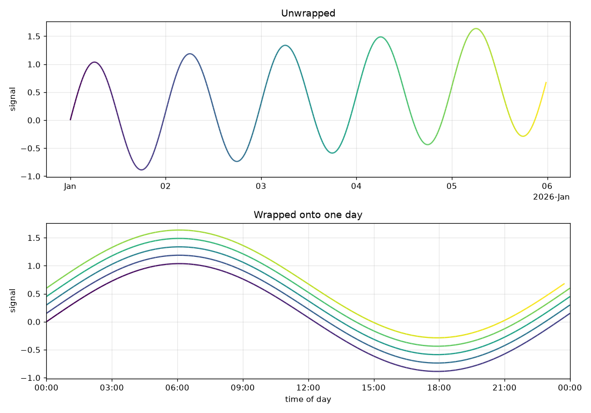

# mpl_wrap

[](https://github.com/scottshambaugh/mpl_wrap/actions/workflows/builds.yml)
[](https://github.com/scottshambaugh/mpl_wrap/actions/workflows/tests.yml)

Matplotlib helper functions for plotting **wrapped, angular, or periodic data**: angles,
phases, times of day, longitudes, and anything else that repeats or rotates.

Manually plotting this data can be tricky. Using a modulus such as `y % 360` is simple,
but introduces a few problems:
* Line jumps at the crossing points, and lines that stop short of the wrap boundaries at the crossing points
* Aliasing when data spans multiple crossings, obscuring the real underlying behavior
* Completely broken rendering for fill_between

`mpl_wrap` solves these issues, and provides simple functions to make plotting wrapped
data easy.

<p align="center">
  
</p>

## Installation

Not yet released to PyPI. Install from source:

```
git clone https://github.com/scottshambaugh/mpl_wrap.git
cd mpl_wrap
uv sync --group dev
```

## Basic Usage

```python
import numpy as np
import matplotlib.pyplot as plt
from mpl_wrap import set_wrap, plot_wrapped, fill_between_wrapped, errorbar_wrapped

t = np.linspace(0, 10, 500)
angle = 80.0 * t  # degrees
width = 5.0 + 4.0 * t  # degrees

fig, ax = plt.subplots()
set_wrap(ax, wrapy=(0, 360))  # helpers on ax now wrap y into (0, 360)
fill_between_wrapped(ax, t, angle - width, angle + width, alpha=0.3, label='uncertainty')
plot_wrapped(ax, t, angle, label='angle')
ax.set(xlabel="time (s)", ylabel="angle (deg)")
ax.legend()
```

<p align="center">
  
</p>

The helpers mirror their matplotlib counterparts, taking the target `Axes` as
the first argument plus optional `wrapx` / `wrapy` `(min, max)` windows:

| mpl_wrap                                 | mirrors           |
| ---------------------------------------- | ----------------- |
| `plot_wrapped(ax, x, y, ...)`            | `ax.plot`         |
| `scatter_wrapped(ax, x, y, ...)`         | `ax.scatter`      |
| `fill_between_wrapped(ax, x, y1, y2)`    | `ax.fill_between` |
| `stairs_wrapped(ax, values, edges)`      | `ax.stairs`       |
| `errorbar_wrapped(ax, x, y, yerr, xerr)` | `ax.errorbar`     |

Passing `wrapx=False` / `wrapy=False` disables wrapping for a single call (or
clears the stored window when passed to `set_wrap`), and `wrapx=True` /
`wrapy=True` requires the stored window.
`set_wrap` also sets the axis limits to the window by default. Opt out with
`set_lims=False`, or pass `seam_lines=True` to mark the window edges with
lines.

You must pass the original unwrapped data for these to work.
If your data is already wrapped, [`np.unwrap`](https://numpy.org/doc/stable/reference/generated/numpy.unwrap.html) may be able to recover that if it's sampled at a high enough rate.

### API

The helpers are free functions, and are also available as methods on an
`AxesWrap` axes. These three are equivalent:

```python
from mpl_wrap import set_wrap, plot_wrapped, wrap_axes

# 1. Free functions, on any existing axes
fig, ax = plt.subplots()
set_wrap(ax, wrapy=(0, 360))
plot_wrapped(ax, t, angle)

# 2. Methods on an AxesWrap axes, created with the "wrap" projection
fig, ax = plt.subplots(subplot_kw={"projection": "wrap"})
ax.set_wrap(wrapy=(0, 360))
ax.plot_wrapped(t, angle)

# 3. Methods on an existing axes, upgraded in place from Axes to AxesWrap
fig, ax = plt.subplots()
wrap_axes(ax, wrapy=(0, 360))
ax.plot_wrapped(t, angle)
```

The data processing is also exposed on its own: `wrap_line` and `wrap_points`
take data plus windows and return the wrapped arrays without plotting anything
(also available as `AxesWrap` methods).

### Wrapping x, y, or both

Both axes can be wrapped independently or together:

<p align="center">
  
</p>

### Datetime axes

Datetime data and windows work on either axis. Here a five-day series is wrapped
to show a time-of-day view:

```python
set_wrap(ax, wrapx=(t0, t0 + np.timedelta64(1, "D")))
plot_wrapped(ax, times, signal)
```

<p align="center">
  
</p>
